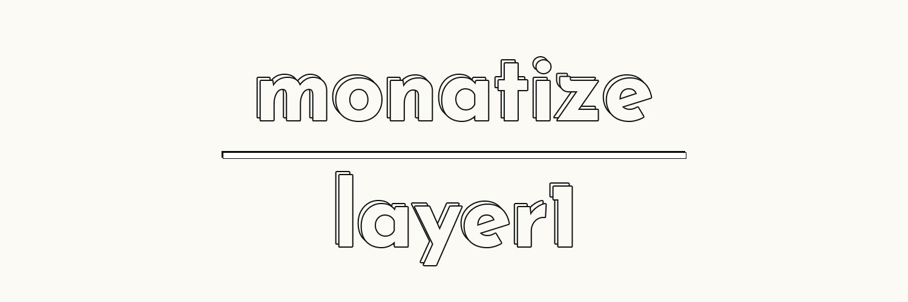

# Layer1 By Monatize



## Overview

Layer1 includes:

-   A full creator dashboard
    -   Create and customize sites
    -   Deploy and view smart contracts
    -   Randomize assets
    -   View analytics
    -   Market yourself
    -   & More
-   The actual viewer page
    -   Allows visitors to come see the site and mint

## How to develop?

First, you want to clone the repo to your local machine. To get started:

```bash
$ git clone https://github.com/Monatize/layer1.git
```

After you've cloned the repository, be sure to install all neccesary packages.
Layer1 uses [pnpm](https://pnpm.io) for package management. Once they're
installed, you can open it in your preffered text editor, and run it. This
documentation uses VSCode as an example, but it is up to you.

```bash
$ pnpm install
$ code .
$ pnpm run dev
```

### **_Important_**!

Before you begin to make changes, be sure to create and switch to a new git
branch, correctly named, so you can properly merge later on.

To do this, use the `git switch -c` command to create and switch to a new branch

```bash
$ git switch -c my-new-branch
```

Have fun building, and WAGMI!
